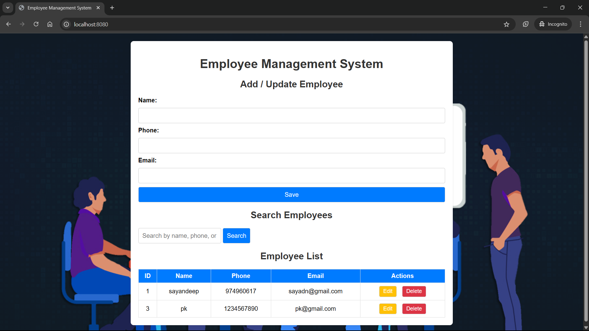

# Employee Management System

The **Employee Management System** is a Spring Boot-based web application that allows users to manage employee records. It provides features such as adding, updating, deleting, and searching employees. The application also includes user authentication and registration functionality using Spring Security.

---

## 📑 Table of Contents

- [Features](#features)
- [Technologies Used](#technologies-used)
- [Project Structure](#project-structure)
- [Setup Instructions](#setup-instructions)
- [API Endpoints](#api-endpoints)
- [Codebase Overview](#codebase-overview)
- [Frontend Overview](#frontend-overview)
- [Database Configuration](#database-configuration)

---

## 🚀 Features

- Add, update, delete, and search employees
- User authentication and registration
- RESTful APIs for backend operations
- Responsive frontend built with HTML, CSS, and JavaScript
- PostgreSQL database integration
- Secure password storage using BCrypt encryption

---

## 🛠️ Technologies Used

- **Backend**: Spring Boot, Spring Security, Spring Data JPA
- **Frontend**: HTML, CSS, JavaScript
- **Database**: PostgreSQL
- **Build Tool**: Maven
- **Java Version**: 21
- **Libraries**: Lombok, BCrypt

---

## 📂 Project Structure

```
EMS/
├── src/
│   ├── main/
│   │   ├── java/com/example/ems/
│   │   │   ├── controller/        # REST Controllers
│   │   │   ├── model/             # JPA Entities
│   │   │   ├── repository/        # Repositories (JPA)
│   │   │   ├── service/           # Service Layer
│   │   │   └── config/            # Spring Security Config
│   │   └── resources/
│   │       ├── static/            # HTML/CSS/JS
│   │       ├── templates/
│   │       └── application.properties
├── pom.xml
└── README.md
```

---

## 🧰 Setup Instructions

### Prerequisites

- Java 21
- Maven
- PostgreSQL running and a database named `emp` created

### Steps

```bash
git clone https://github.com/Deeppati2005/EMS.git
cd EMS
mvn clean install
mvn spring-boot:run
```

The app will be available at: `http://localhost:8080`

---

## 📡 API Endpoints

| HTTP Method | Endpoint                  | Description                                   | Request Body                                                                 |
|-------------|---------------------------|-----------------------------------------------|-------------------------------------------------------------------------------|
| GET         | `/emps`                   | Fetch all employees                           | N/A                                                                           |
| GET         | `/emp/{id}`               | Fetch an employee by ID                       | N/A                                                                           |
| POST        | `/emp`                    | Add a new employee                            | `{ "name": "John", "phone": "1234567890", "email": "john@example.com" }`     |
| PUT         | `/emp/{id}`               | Update an existing employee by ID             | `{ "name": "John", "phone": "1234567890", "email": "john@example.com" }`     |
| DELETE      | `/emp/{id}`               | Delete an employee by ID                      | N/A                                                                           |
| GET         | `/emp/search/{keyword}`   | Search employees by name, phone, or email     | N/A                                                                           |
| POST        | `/register`               | Register a new user                           | `{ "username": "user1", "password": "password123" }`                         |
| GET         | `/hello`                  | Test endpoint for authenticated users         | N/A                                                                           |

---

## 🧠 Codebase Overview

### 1. Backend

#### 🧾 Controllers

- **EmpController**:  
  Handles employee-related operations.  
  Endpoints: `/emps`, `/emp/{id}`, `/emp/search/{keyword}`

- **MyController**:  
  Handles user registration and a test endpoint for authenticated access.

#### ⚙️ Services

- **EmpService**:  
  Contains business logic for employee operations.

- **MyUserDetailsService**:  
  Manages user authentication and registration with Spring Security.

#### 🗃 Repositories

- **EmpRepo**:  
  Extends `JpaRepository<Employee, Integer>` for CRUD operations on employees.

- **UserRepo**:  
  Extends `JpaRepository<User, Integer>` for user registration and login.

#### 📦 Models

- **Employee**:  
  Represents the employee entity with fields: `id`, `name`, `phone`, `email`.

- **User**:  
  Represents the user entity with fields: `id`, `username`, `password`.

- **UserPrincipal**:  
  Implements `UserDetails` to support Spring Security authentication.

#### 🔐 Configuration

- **SecurityConfig**:  
  Configures HTTP security for public and secured endpoints, handles CORS and CSRF, password encoding using BCrypt, and authentication manager.

---

### 2. Frontend Overview

- **HTML** (`index.html`)  
  - Contains the UI structure for displaying and interacting with employee data  
  - Sections for: Add/Update form, Search box, Employee list

- **CSS** (`styles.css`)  
  - Provides a clean, responsive layout for the application

- **JavaScript** (`script.js`)  
  - Makes API calls to fetch/add/update/delete/search employees  
  - Dynamically updates the UI with results

---

## 🧾 Database Configuration

The application uses **PostgreSQL**. The schema is automatically generated via JPA entity classes.

### 🧱 `Employee` Table

| Column | Type    | Constraints                  |
|--------|---------|------------------------------|
| id     | Integer | Primary Key, Auto-Increment  |
| name   | String  | Not Null                     |
| phone  | String  | Not Null                     |
| email  | String  | Not Null                     |

### 👤 `User` Table

| Column   | Type    | Constraints               |
|----------|---------|---------------------------|
| id       | Integer | Primary Key               |
| username | String  | Not Null, Unique          |
| password | String  | Not Null (BCrypt encoded) |

---

## 🔒 Security

- Passwords are securely hashed using **BCrypt**
- Endpoints like `/hello` are protected and require valid authentication
- Spring Security handles login, logout, and user session management
- CORS is enabled for all origins

---

## 📷 Screenshots

### 🏠 Landing Page


---
